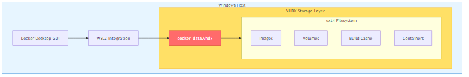
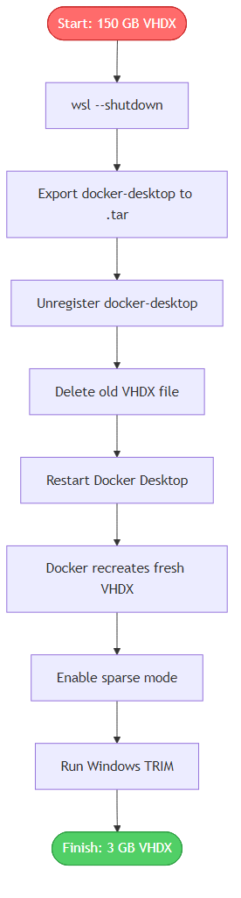
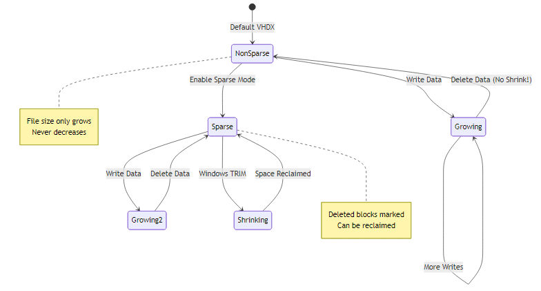
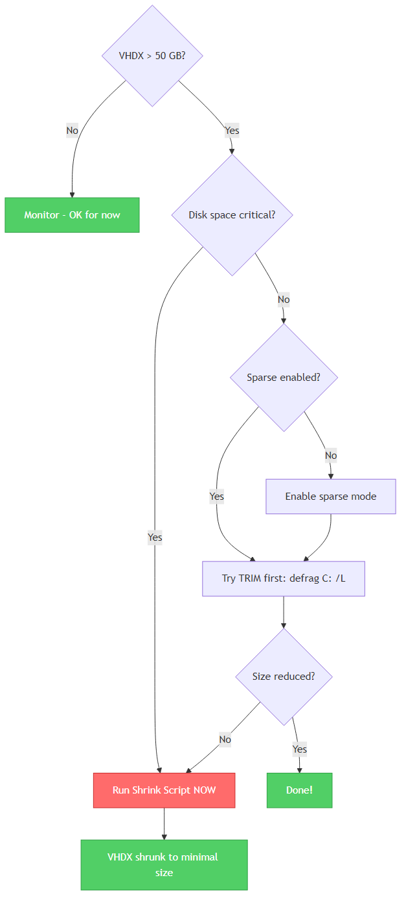

<div align="center">

# 🐳 Docker Desktop WSL2 VHDX Shrink Toolkit

### A battle-tested solution for controlling massive disk growth during AI development workflows

[](https://opensource.org/licenses/MIT)
[](https://docs.microsoft.com/en-us/powershell/)
[](https://docs.microsoft.com/en-us/windows/wsl/)
[](https://www.docker.com/products/docker-desktop/)
[](https://www.microsoft.com/windows)

<br />

**Shrink your Docker Desktop VHDX**

[Getting Started](#-quick-start) •
[Why This Exists](#-why-this-exists) •
[Documentation](docs/docker-wsl-vhdx-shrink-guide.md) •
[Best Practices](#-best-practices-for-ai-engineers)

</div>

---

## 📋 Table of Contents

- [Why This Exists](#-why-this-exists)
- [The Problem](#-the-problem)
- [Architecture Overview](#-architecture-overview)
- [Features](#-features)
- [Quick Start](#-quick-start)
- [Repository Structure](#-repository-structure)
- [How It Works](#-how-it-works)
- [Best Practices for AI Engineers](#-best-practices-for-ai-engineers)
- [Troubleshooting](#-troubleshooting)
- [Contributing](#-contributing)
- [License](#-license)

---

## 🎯 Why This Exists

Modern AI development workflows push Docker to the limit:

| Challenge | Impact |
|-----------|--------|
| Heavy multistage builds | Layers accumulate rapidly |
| Large language model weights | Multi-GB checkpoints stored in containers |
| BuildKit caching | Cache grows without bounds |
| Dataset volumes | Logs and preprocessed shards pile up |
| Frequent rebuilds | Each iteration adds to disk usage |

On Windows, all of this gets captured inside a growing WSL2 VHDX file.

**And it never shrinks by itself.**

This toolkit solves the problem cleanly with a one-click script.

---

## 🔴 The Problem

WSL2 stores each Linux distro inside an `ext4.vhdx` virtual disk. This VHDX is configured to **auto-expand** but **never auto-shrink**.

```
Before cleanup:  docker_data.vhdx = 150 GB  ❌
After cleanup:   docker_data.vhdx = 3 GB    ✅
```

Even running these commands does NOT reduce the physical disk footprint:

```powershell
docker system prune -a --volumes
docker builder prune --all
```

The files are deleted inside the Linux filesystem, but the Windows VHDX file remains bloated.

---

## 🏗 Architecture Overview

### Docker Desktop WSL2 Storage Architecture

<div align="center">



</div>

Docker Desktop on Windows uses WSL2 to run the Linux-based Docker engine. All container data, images, and volumes are stored inside a dynamically expanding VHDX virtual disk file.

### The Problem: Auto-Expand, Never Shrink

<div align="center">


</div>

WSL2 virtual disks automatically grow as you build images and create volumes, but they **never shrink automatically** when you delete data.

### The Solution: Export-Unregister-Import Workflow

<div align="center">



</div>

The only guaranteed way to shrink the VHDX is to export the distro, unregister it (which deletes the bloated VHDX), and let Docker Desktop recreate a fresh, compact disk.

---

## ✨ Features

| Feature | Description |
|---------|-------------|
| 🔄 **One-click shrink** | Single PowerShell script handles everything |
| 💾 **Safe export** | Preserves your Docker environment before changes |
| 🧹 **Complete cleanup** | Removes orphan VHDX files and metadata |
| ⚡ **Sparse mode** | Enables WSL2 sparse VHDX for future maintenance |
| 📊 **Progress reporting** | Clear status updates throughout the process |
| 🛡️ **Error handling** | Graceful failures with rollback options |
| 📖 **Full documentation** | Technical guide and troubleshooting included |

---

## 🚀 Quick Start

### Prerequisites

- Windows 10/11 with WSL2 enabled
- Docker Desktop installed and using WSL2 backend
- PowerShell 5.1 or later
- Administrator privileges

### Option 1: Run the shrink script directly

```powershell
# Clone the repository
git clone https://github.com/adnanss/docker-wsl-vhdx-cleanup.git
cd docker-wsl-vhdx-cleanup

# Run as Administrator
powershell -ExecutionPolicy Bypass -File .\scripts\shrink-docker-wsl.ps1
```

### Option 2: Manual step-by-step

```powershell
# 1. Shutdown WSL
wsl --shutdown

# 2. Export the docker-desktop distro
wsl --export docker-desktop docker.tar

# 3. Unregister the distro (removes the bloated VHDX)
wsl --unregister docker-desktop

# 4. Delete the old VHDX file manually if it still exists
Remove-Item "$env:LOCALAPPDATA\Docker\wsl\disk\docker_data.vhdx" -Force

# 5. Restart Docker Desktop - it will recreate a fresh, small VHDX
Start-Process "$env:ProgramFiles\Docker\Docker\Docker Desktop.exe"
```

---

## 📁 Repository Structure

```
docker-wsl-vhdx-cleanup/
│
├── 📄 README.md                    # This file
├── 📄 LICENSE                      # MIT License
├── 📄 CONTRIBUTING.md              # Contribution guidelines
├── 📄 .gitignore                   # Git ignore patterns
│
├── 📂 assets/
│   ├── architecture-diagram-1.png  # WSL2 Storage Architecture
│   ├── architecture-diagram-2.png  # The Problem Visualization
│   ├── architecture-diagram-3.png  # Solution Workflow
│   ├── architecture-diagram-4.png  # Sparse Mode Behavior
│   ├── architecture-diagram-5.png  # Script Execution Sequence
│   └── architecture-diagram-6.png  # Decision Tree
│
├── 📂 docs/
│   ├── docker-wsl-vhdx-shrink-guide.md   # Comprehensive technical guide
│   └── mermaid-diagram.md          # Architecture diagrams (Mermaid source)
│
├── 📂 scripts/
│   ├── shrink-docker-wsl.ps1       # Main shrink automation script
│   └── validate-wsl-state.ps1      # Diagnostic validation script
│
└── 📂 .github/
    ├── workflows/
    │   └── lint-scripts.yml        # CI validation for PowerShell
    └── ISSUE_TEMPLATE/
        ├── bug_report.md           # Bug report template
        └── feature_request.md      # Feature request template
```

---

## ⚙️ How It Works

### Script Execution Flow

<div align="center">


</div>

### Step 1: Shutdown and Export

The script first shuts down all WSL instances and exports the `docker-desktop` distro to a tar file. This preserves your Docker environment.

```powershell
wsl --shutdown
wsl --export docker-desktop docker.tar
```

### Step 2: Unregister and Delete

The old WSL distro is unregistered, which removes the bloated VHDX from WSL's management. The script then deletes any orphan VHDX files.

```powershell
wsl --unregister docker-desktop
Remove-Item "$env:LOCALAPPDATA\Docker\wsl\disk\docker_data.vhdx"
```

### Step 3: Restart and Rebuild

Docker Desktop is restarted. It detects the missing distro and automatically creates a fresh, compact VHDX (typically 2-5 GB).

### Step 4: Enable Sparse Mode

The script enables WSL2 sparse mode on the new VHDX, allowing future automatic space reclamation:

```powershell
wsl --manage docker-desktop --set-sparse true --allow-unsafe
```

<div align="center">



</div>

### Step 5: Trigger Windows TRIM

Finally, the script triggers Windows SSD trimming to release the freed space:

```powershell
defrag C: /L
```

---

## 🎓 Best Practices for AI Engineers

### 1. Build Optimization

```dockerfile
# Use multi-stage builds
FROM python:3.11-slim AS builder
COPY requirements.txt .
RUN pip install --user -r requirements.txt

FROM python:3.11-slim
COPY --from=builder /root/.local /root/.local
```

### 2. Effective .dockerignore

```dockerignore
# AI/ML specific ignores
*.pt
*.pth
*.ckpt
*.safetensors
checkpoints/
models/
datasets/
__pycache__/
.git/
node_modules/
```

### 3. BuildKit Cache Mounts

```dockerfile
# syntax=docker/dockerfile:1.4
FROM python:3.11-slim
RUN --mount=type=cache,target=/root/.cache \
    pip install torch transformers accelerate
```

### 4. Volume Strategy

```yaml
# docker-compose.yml - Use external volumes for large data
volumes:
  model-cache:
    driver: local
    driver_opts:
      type: none
      o: bind
      device: D:/docker-volumes/models
```

### 5. Regular Maintenance

```powershell
# Run weekly or when disk usage exceeds threshold
docker system prune -a --volumes
docker builder prune --all --filter "until=168h"

# Check current usage
docker system df
```

### 6. WSL Configuration

Create or update `%USERPROFILE%\.wslconfig`:

```ini
[wsl2]
memory=12GB
processors=6
swap=4GB
localhostForwarding=true
```

---

## 🔧 Troubleshooting

### When Should You Run the Shrink Script?

<div align="center">



</div>

### "Distro not found" error

```powershell
# List all WSL distros to find the correct name
wsl --list --all --verbose
```

### Sparse mode fails

```powershell
# Force sparse mode with unsafe flag (required on some Insider builds)
wsl --manage docker-desktop --set-sparse true --allow-unsafe
```

### VHDX still large after script

```powershell
# Check if sparse is enabled
fsutil sparse queryflag "$env:LOCALAPPDATA\Docker\wsl\disk\docker_data.vhdx"

# If not sparse, run export/import again
```

### Docker Desktop fails to start after cleanup

```powershell
# Reset Docker's WSL metadata
Remove-Item -Recurse -Force "$env:LOCALAPPDATA\Docker\wsl" -ErrorAction SilentlyContinue

# Restart Docker Desktop - it will rebuild everything
```

For more detailed troubleshooting, see the [full technical guide](docs/docker-wsl-vhdx-shrink-guide.md).

---

## 🤝 Contributing

Contributions are welcome! If you have discovered:

- Additional WSL shrink techniques
- Sparse-mode behaviors on specific Windows builds
- Performance improvements for ML workloads

Please open an issue or submit a pull request.

---

## 📄 License

This project is licensed under the MIT License - see the [LICENSE](LICENSE) file for details.

---

<div align="center">

**Built with practical experience from AI infrastructure engineering**

*Solving the problems that slow down ML development workflows*

</div>
