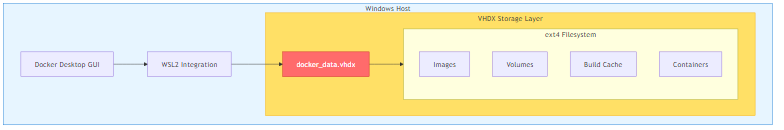
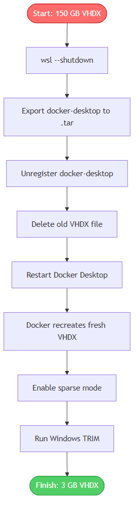
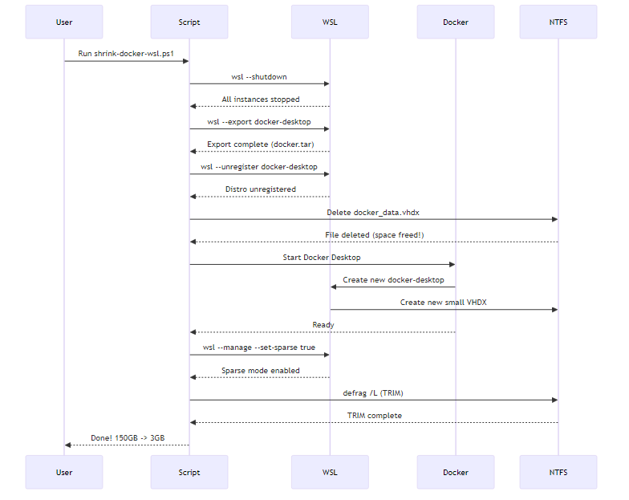
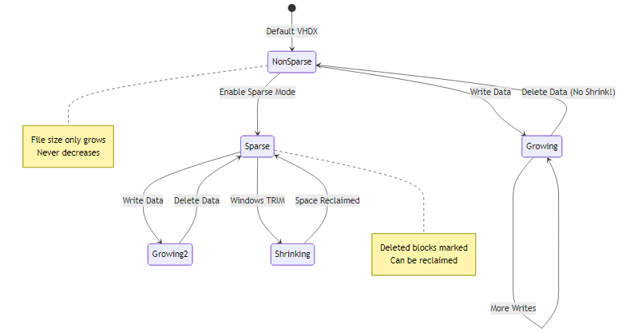
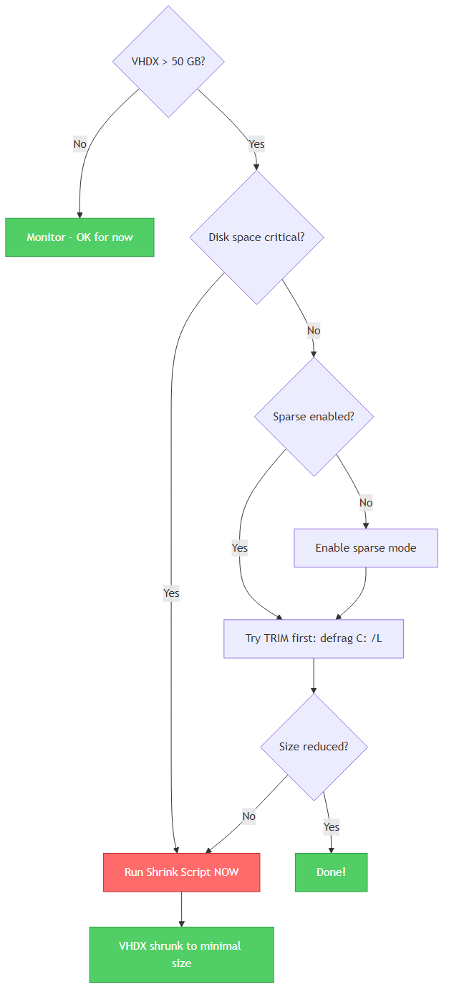

<div align="center">

# 🐳 Docker Desktop WSL2 VHDX Shrink Toolkit

### A battle-tested solution for controlling massive disk growth during AI development workflows

[](https://opensource.org/licenses/MIT)
[](https://docs.microsoft.com/en-us/powershell/)
[](https://docs.microsoft.com/en-us/windows/wsl/)
[](https://www.docker.com/products/docker-desktop/)
[](https://www.microsoft.com/windows)

<br />

**Shrink your Docker Desktop VHDX**

[Getting Started](#-quick-start) •
[Platform Support](#-platform-support) •
[Why This Exists](#-why-this-exists) •
[Documentation](docs/docker-wsl-vhdx-shrink-guide.md) •
[Best Practices](#-best-practices-for-ai-engineers)

</div>

---

## 📋 Table of Contents

- [Why This Exists](#-why-this-exists)
- [Platform Support](#-platform-support)
- [The Problem](#-the-problem)
- [Architecture Overview](#-architecture-overview)
- [Features](#-features)
- [Quick Start](#-quick-start)
- [Repository Structure](#-repository-structure)
- [How It Works](#-how-it-works)
- [Best Practices for AI Engineers](#-best-practices-for-ai-engineers)
- [Troubleshooting](#-troubleshooting)
- [Contributing](#-contributing)
- [License](#-license)

---

## 🎯 Why This Exists

Modern AI development workflows push Docker to the limit:

| Challenge | Impact |
| ----------- | -------- |
| Heavy multistage builds | Layers accumulate rapidly |
| Large language model weights | Multi-GB checkpoints stored in containers |
| BuildKit caching | Cache grows without bounds |
| Dataset volumes | Logs and preprocessed shards pile up |
| Frequent rebuilds | Each iteration adds to disk usage |

On Windows, all of this gets captured inside a growing WSL2 VHDX file.

**And it never shrinks by itself.**

This toolkit solves the problem cleanly with a one-click script.

---

## 🌍 Platform Support

| Platform | Needs this toolkit? | Why |
| ---------- | --------------------- | ----- |
| **Windows (Docker Desktop + WSL2)** | **Yes** | Docker data lives in auto-expanding VHDX files that do not shrink after `docker prune` |
| **Linux (native Docker)** | No | Docker uses the host filesystem directly; deleted data is reclaimed by the OS |
| **macOS (Docker Desktop)** | No | Docker Desktop on macOS uses a Linux VM with its own disk image, but day-to-day `docker system prune` and Docker Desktop's built-in disk management are usually sufficient. This repo targets the Windows/WSL2 VHDX problem specifically |

### Windows use cases

Run the shrink script when:

- `docker_data.vhdx` or `ext4.vhdx` is much larger than `docker system df` reports
- You are on **Windows 11 Home** and cannot use `Optimize-VHD`
- Your install uses the **standalone `docker_data.vhdx` layout** (no `docker-desktop-data` WSL distro)
- AI/ML workflows have left large build caches, image layers, or volumes on disk

### Windows layout gaps (now handled in one command)

Older Docker Desktop installs store images/volumes in a **`docker-desktop-data`** WSL distro (`wsl\data\ext4.vhdx`). Newer installs often use a **standalone disk file** instead:

```
%LOCALAPPDATA%\Docker\wsl\disk\docker_data.vhdx   ← images, volumes, build cache
%LOCALAPPDATA%\Docker\wsl\main\ext4.vhdx          ← Docker engine (small)
```

Two gaps blocked effective compaction on many Windows machines:

| Gap | Symptom | Script handling |
|-----|---------|-----------------|
| **No `docker-desktop-data` distro** | `-PruneDocker` and in-distro `fstrim` were skipped | Host `docker` CLI prune + `wsl --mount` + `fstrim` on `docker_data.vhdx` |
| **Windows Home (no Hyper-V module)** | `Optimize-VHD` unavailable; VHDX size unchanged | Automatic **`diskpart compact vdisk`** fallback |

Both paths are handled by the same command:

```powershell
powershell -ExecutionPolicy Bypass -File .\scripts\shrink-docker-wsl.ps1 -PruneDocker
```

Optional: `-TrimHelperDistro Ubuntu` if auto-detection cannot find a non-Docker WSL distro for `fstrim`.
Optional: `-WorkFolder E:\docker-wsl-work` to force temp/export location on a specific drive.

### Low disk space on C

The script checks two requirements before shrinking:

| Requirement | Drive | Typical need |
|-------------|-------|----------------|
| **VHDX compaction** | Same drive as `docker_data.vhdx` (usually C:) | ≥ 5 GB free (more for large VHDX files) |
| **Temp / export files** | Any fixed drive | ≥ 2 GB free (safe mode); largest VHDX + 5 GB for `-FullReset` export |

When C: is below **10 GB** free, the script automatically places work files under `{drive}:\docker-wsl-work` on the drive with the most free space (for example `E:\docker-wsl-work`).

If **no drive** has enough space, the script exits and tells you how much to free before re-running:

```powershell
powershell -ExecutionPolicy Bypass -File .\scripts\shrink-docker-wsl.ps1 -PruneDocker
```

Force a work folder on E: when C: is tight:

```powershell
powershell -ExecutionPolicy Bypass -File .\scripts\shrink-docker-wsl.ps1 -PruneDocker -WorkFolder E:\docker-wsl-work
```

---

## 🔴 The Problem

WSL2 stores each Linux distro inside an `ext4.vhdx` virtual disk. This VHDX is configured to **auto-expand** but **never auto-shrink**.

```
Before cleanup:  docker_data.vhdx = 150 GB  ❌
After cleanup:   docker_data.vhdx = 3 GB    ✅
```

Even running these commands does NOT reduce the physical disk footprint:

```powershell
docker system prune -a --volumes
docker builder prune --all
```

The files are deleted inside the Linux filesystem, but the Windows VHDX file remains bloated.

---

## 🏗 Architecture Overview

### Docker Desktop WSL2 Storage Architecture

<div align="center">



</div>

Docker Desktop on Windows uses WSL2 to run the Linux-based Docker engine. All container data, images, and volumes are stored inside a dynamically expanding VHDX virtual disk file.

### The Problem: Auto-Expand, Never Shrink

<div align="center">


</div>

WSL2 virtual disks automatically grow as you build images and create volumes, but they **never shrink automatically** when you delete data.

### The Solution: Safe Compaction First, Full Reset Only When Needed

<div align="center">



</div>

This toolkit implements two complementary strategies:

- **Non-destructive compaction (default)**  
  Clean up unused Docker data, run filesystem TRIM (`fstrim`), then compact the VHDX with `Optimize-VHD` or **`diskpart compact vdisk`** on Windows Home. Supports both **`docker-desktop-data`** and standalone **`docker_data.vhdx`** layouts. Preserves your Docker images, containers, and volumes.

- **Full reset (opt-in, destructive)**  
  For cases where you explicitly want a brand-new Docker environment, the script can export, unregister, and delete the VHDX, then let Docker Desktop recreate a fresh disk and optionally re-import the data distro.

---

## ✨ Features

| Feature | Description |
| --------- | ------------- |
| 🔄 **One-click shrink (safe by default)** | Single PowerShell script that compacts VHDX without wiping Docker state |
| 🧹 **In-distro cleanup** | Optional `-PruneDocker` flag runs `docker system prune` / `docker builder prune` (in WSL or via host CLI) |
| ✂️ **Non-destructive VHDX compaction** | Uses `fstrim` + `Optimize-VHD` or **`diskpart compact vdisk`** (Windows Home) |
| 🏠 **Windows Home + docker_data.vhdx** | Standalone disk layout: mount → fstrim → compact in one run |
| 💽 **Low disk space handling** | Auto-picks work/temp folder on another drive when C: is low; exits with clear guidance if space is insufficient |
| 💾 **Optional full reset mode** | `-FullReset` opt-in path for export/unregister/delete when you truly want a clean Docker slate |
| ⚡ **Sparse mode** | Enables WSL2 sparse VHDX for future maintenance (where supported) |
| 📊 **Progress reporting** | Clear status updates throughout the process |
| 🛡️ **Error handling** | Graceful failures with conservative defaults |
| 📖 **Full documentation** | Technical guide and troubleshooting included |

---

## 🚀 Quick Start

### Prerequisites

- Windows 10/11 with WSL2 enabled
- Docker Desktop installed and using WSL2 backend
- PowerShell 5.1 or later
- Administrator privileges

### Option 1: Safe, non-destructive shrink (recommended)

```powershell
# Clone the repository
git clone https://github.com/adnanss/docker-wsl-vhdx-cleanup.git
cd docker-wsl-vhdx-cleanup

# Run as Administrator (safe mode: preserves Docker images/containers/volumes)
powershell -ExecutionPolicy Bypass -File .\scripts\shrink-docker-wsl.ps1 -PruneDocker
```

This will:

- Check free space on all drives; **auto-use E: (or another drive)** for temp/export when C: is low
- Stop with a clear message if **any required drive** lacks space (free space, then re-run)
- Optionally prune unused Docker data (`-PruneDocker`) — inside `docker-desktop-data` when present, otherwise via the **host Docker CLI**
- Run filesystem TRIM (`fstrim`) — inside the data distro **or** on standalone `docker_data.vhdx` via `wsl --mount`
- Shut down WSL and compact VHDX files with **`Optimize-VHD -Mode Full`** (Pro/Enterprise) or **`diskpart compact vdisk`** (Windows Home)
- Trigger Windows TRIM on the host volume

Verify afterward:

```powershell
powershell -ExecutionPolicy Bypass -File .\scripts\validate-wsl-state.ps1
```

### Option 2: Full reset (destructive, opt-in)

```powershell
# 1. Shutdown WSL
wsl --shutdown

# 2. (Optional) Back up your Docker data via export/import or your own backup strategy.
#
# 3. Run the script in full reset mode (WARNING: this can reset Docker state)
powershell -ExecutionPolicy Bypass -File .\scripts\shrink-docker-wsl.ps1 -FullReset
```

Only use this mode if you **explicitly want a fresh Docker environment** or have backups of all important images/volumes.

---

## 📁 Repository Structure

```
docker-wsl-vhdx-cleanup/
│
├── 📄 README.md                    # This file
├── 📄 LICENSE                      # MIT License
├── 📄 CONTRIBUTING.md              # Contribution guidelines
├── 📄 .gitignore                   # Git ignore patterns
│
├── 📂 assets/
│   ├── architecture-diagram-1.png  # WSL2 Storage Architecture
│   ├── architecture-diagram-2.png  # The Problem Visualization
│   ├── architecture-diagram-3.png  # Solution Workflow
│   ├── architecture-diagram-4.png  # Sparse Mode Behavior
│   ├── architecture-diagram-5.png  # Script Execution Sequence
│   └── architecture-diagram-6.png  # Decision Tree
│
├── 📂 docs/
│   ├── docker-wsl-vhdx-shrink-guide.md   # Comprehensive technical guide
│   └── mermaid-diagram.md          # Architecture diagrams (Mermaid source)
│
├── 📂 scripts/
│   ├── shrink-docker-wsl.ps1       # Main shrink automation script
│   └── validate-wsl-state.ps1      # Diagnostic validation script
│
└── 📂 .github/
    ├── workflows/
    │   └── lint-scripts.yml        # CI validation for PowerShell
    └── ISSUE_TEMPLATE/
        ├── bug_report.md           # Bug report template
        └── feature_request.md      # Feature request template
```

---

## ⚙️ How It Works

### Script Execution Flow (Safe Mode: Default)

<div align="center">



</div>

### Step 1: WSL + Docker cleanup

In safe mode, the script:

- Optionally prunes unused Docker data when `-PruneDocker` is set
- Uses the **classic** path when `docker-desktop-data` exists:

```powershell
wsl --shutdown
wsl -d docker-desktop-data -- docker system prune -a --volumes -f
wsl -d docker-desktop-data -- docker builder prune --all -f
```

- Uses the **standalone `docker_data.vhdx`** path when that distro is missing (common on Windows Home / newer Docker Desktop):

```powershell
docker system prune -a --volumes -f
docker builder prune --all -f
wsl --shutdown
wsl --mount "$env:LOCALAPPDATA\Docker\wsl\disk\docker_data.vhdx" --vhd
# fstrim inside a helper WSL distro (e.g. Ubuntu), then unmount
```

### Step 2: Filesystem TRIM inside WSL

**Classic layout** — `fstrim` inside `docker-desktop-data`:

```powershell
wsl -d docker-desktop-data -- sudo fstrim -av
```

**Standalone `docker_data.vhdx` layout** — mount the VHDX, then `fstrim` the ext4 filesystem. This marks freed blocks so Windows compaction can reclaim them.

### Step 3: Compact the VHDX (non-destructive)

With WSL shut down, the script compacts VHDX files **without deleting them**:

```powershell
# Windows Pro/Enterprise (Hyper-V module available)
Import-Module Hyper-V
Optimize-VHD -Path "$env:LOCALAPPDATA\Docker\wsl\disk\docker_data.vhdx" -Mode Full

# Windows Home fallback (no Hyper-V module)
diskpart
select vdisk file="C:\Users\<You>\AppData\Local\Docker\wsl\disk\docker_data.vhdx"
attach vdisk readonly
compact vdisk
detach vdisk
```

### Step 4: Enable Sparse Mode

Where supported, the script enables WSL2 sparse mode on the VHDX, allowing better future reclamation:

```powershell
wsl --manage docker-desktop --set-sparse true --allow-unsafe
```

<div align="center">



</div>

### Step 5: Trigger Windows TRIM

Finally, the script triggers Windows SSD trimming to release the freed space:

```powershell
defrag C: /L
```

---

## 🎓 Best Practices for AI Engineers

### 1. Build Optimization

```dockerfile
# Use multi-stage builds
FROM python:3.11-slim AS builder
COPY requirements.txt .
RUN pip install --user -r requirements.txt

FROM python:3.11-slim
COPY --from=builder /root/.local /root/.local
```

### 2. Effective .dockerignore

```dockerignore
# AI/ML specific ignores
*.pt
*.pth
*.ckpt
*.safetensors
checkpoints/
models/
datasets/
__pycache__/
.git/
node_modules/
```

### 3. BuildKit Cache Mounts

```dockerfile
# syntax=docker/dockerfile:1.4
FROM python:3.11-slim
RUN --mount=type=cache,target=/root/.cache \
    pip install torch transformers accelerate
```

### 4. Volume Strategy

```yaml
# docker-compose.yml - Use external volumes for large data
volumes:
  model-cache:
    driver: local
    driver_opts:
      type: none
      o: bind
      device: D:/docker-volumes/models
```

### 5. Regular Maintenance

```powershell
# Run weekly or when disk usage exceeds threshold
docker system prune -a --volumes
docker builder prune --all --filter "until=168h"

# Check current usage
docker system df
```

### 6. WSL Configuration

Create or update `%USERPROFILE%\.wslconfig`:

```ini
[wsl2]
memory=12GB
processors=6
swap=4GB
localhostForwarding=true
```

---

## 🔧 Troubleshooting

### When Should You Run the Shrink Script?

<div align="center">



</div>

### "Distro not found" error

```powershell
# List all WSL distros to find the correct name
wsl --list --all --verbose
```

### Sparse mode fails

```powershell
# Force sparse mode with unsafe flag (required on some Insider builds)
wsl --manage docker-desktop --set-sparse true --allow-unsafe
```

### Insufficient disk space / script exits before shrink

The script checks space **before** shutting down WSL or pruning Docker.

```powershell
# See current free space on all drives
Get-PSDrive -PSProvider FileSystem | Select-Object Name,
  @{N='FreeGB';E={[math]::Round($_.Free/1GB,2)}},
  @{N='TotalGB';E={[math]::Round(($_.Free+$_.Used)/1GB,2)}}
```

| Error | What to do |
| ------- | ------------ |
| **VHDX host drive** (usually C:) low | Free space on that drive — compaction cannot use E: as a substitute |
| **Work/temp drive** low on C: | Script auto-picks another drive; or pass `-WorkFolder E:\docker-wsl-work` |
| **All drives** insufficient | Free the GB amount shown in the error, then re-run |

```powershell
powershell -ExecutionPolicy Bypass -File .\scripts\shrink-docker-wsl.ps1 -PruneDocker -WorkFolder E:\docker-wsl-work
```

### VHDX still large after script

```powershell
# 1. Check Docker usage (host CLI works on all layouts)
docker system df

# 2. Run with aggressive prune (safe mode)
powershell -ExecutionPolicy Bypass -File .\scripts\shrink-docker-wsl.ps1 -PruneDocker

# 3. Verify sparse status
fsutil sparse queryflag "$env:LOCALAPPDATA\Docker\wsl\disk\docker_data.vhdx"

# 4. Validate environment
powershell -ExecutionPolicy Bypass -File .\scripts\validate-wsl-state.ps1
```

If the VHDX is still significantly larger than the reported Docker data size, you may be limited by:

- Unused Docker build cache or volumes still inside the disk (run with `-PruneDocker`)
- No helper WSL distro for `fstrim` on standalone `docker_data.vhdx` (install Ubuntu or pass `-TrimHelperDistro`)
- Other non-Docker data stored inside the VHDX

### Docker Desktop fails to start after cleanup or full reset

```powershell
# Reset Docker's WSL metadata (DESTRUCTIVE: this is similar to a full reset)
Remove-Item -Recurse -Force "$env:LOCALAPPDATA\Docker\wsl" -ErrorAction SilentlyContinue

# Restart Docker Desktop - it will rebuild everything from scratch
```

For more detailed troubleshooting, see the [full technical guide](docs/docker-wsl-vhdx-shrink-guide.md).

---

## 🤝 Contributing

Contributions are welcome! If you have discovered:

- Additional WSL shrink techniques
- Sparse-mode behaviors on specific Windows builds
- Performance improvements for ML workloads

Please open an issue or submit a pull request.

---

## 📄 License

This project is licensed under the MIT License - see the [LICENSE](LICENSE) file for details.

---

<div align="center">

**Built with practical experience from AI infrastructure engineering**

*Solving the problems that slow down ML development workflows*

</div>
